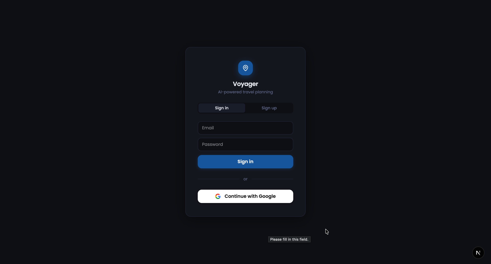
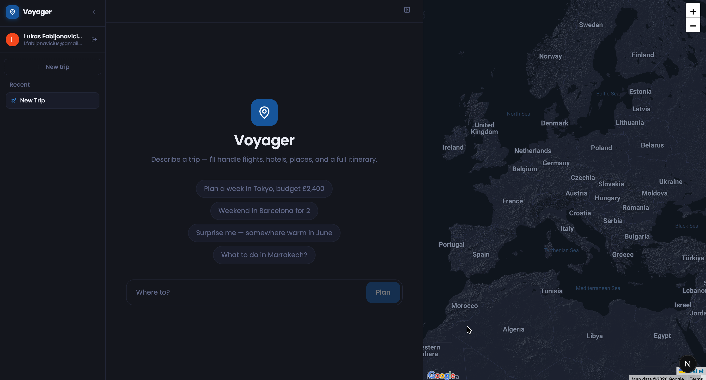
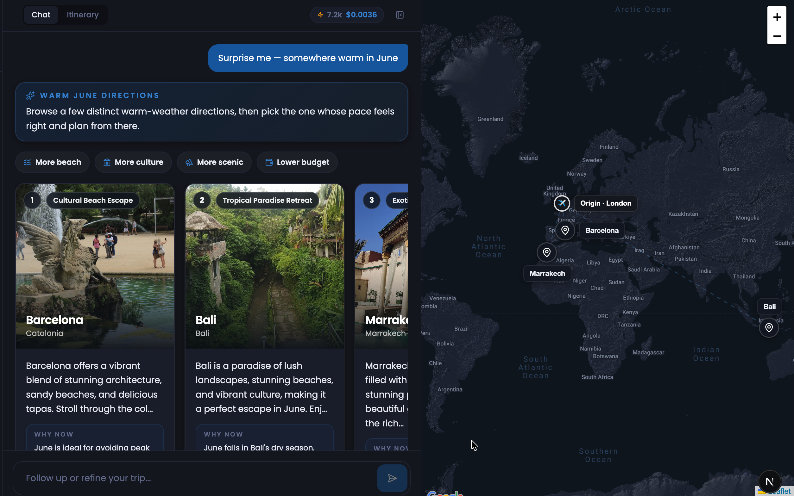
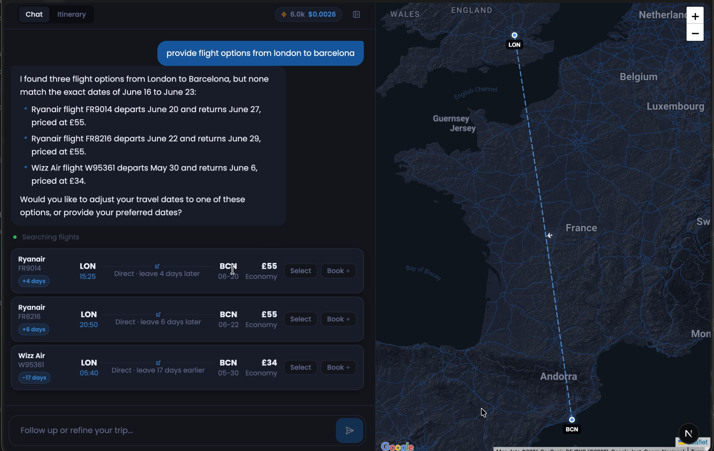
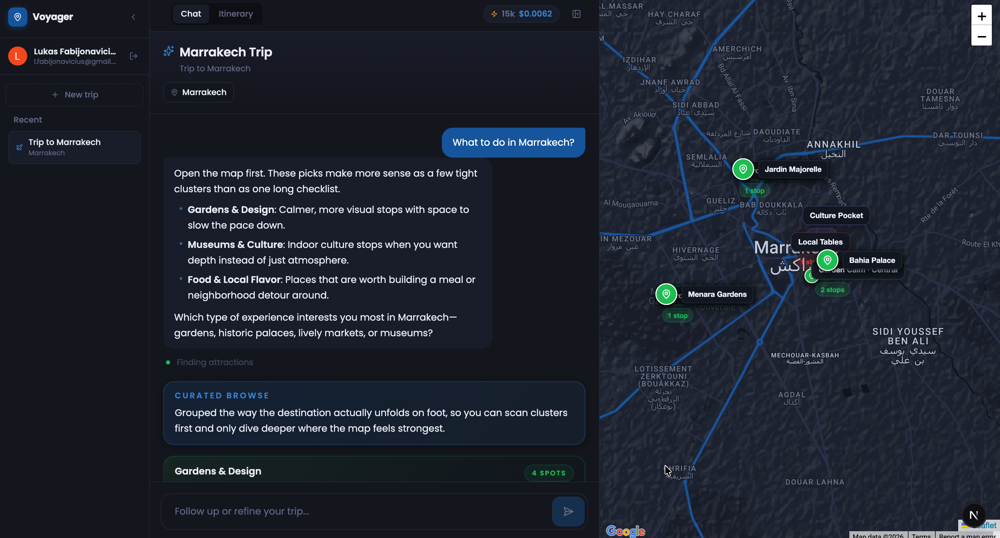
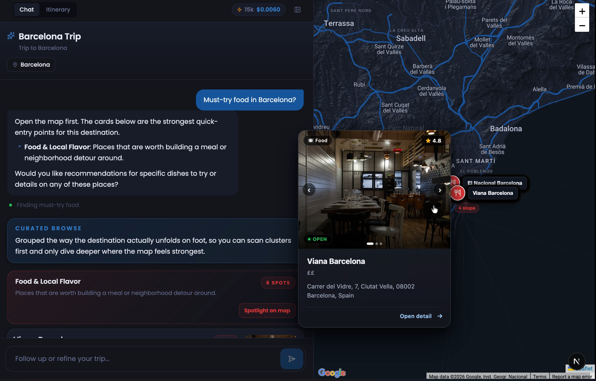
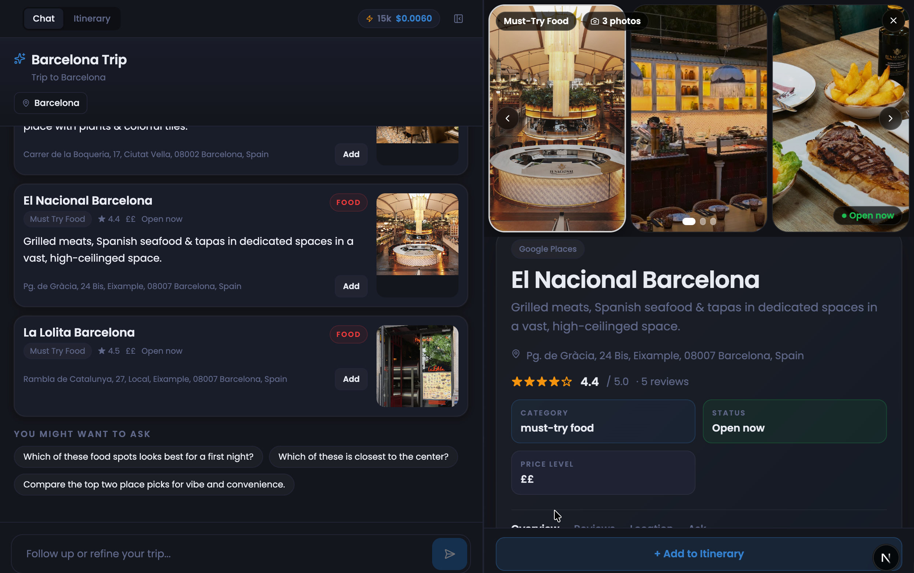

# Voyager — AI Travel Planning Agent

Voyager is a full-stack AI travel assistant that plans trips end-to-end through natural conversation. It finds real flights and hotels, fetches live weather, suggests destinations, builds day-by-day itineraries, and pins everything on an interactive map — all from a single chat interface.

## What it does

A user types something like *"Plan a 5-day trip to Barcelona for 2 adults in June, budget £2,000 total, flying from London"* and Voyager:

1. Searches live flights (Travelpayouts + AeroDataBox)
2. Searches hotels (Booking.com via RapidAPI)
3. Fetches a 5-day weather forecast (OpenWeatherMap)
4. Looks up exchange rates and visa/entry requirements
5. Finds top restaurants and attractions (Google Places)
6. Calculates a cost breakdown against the stated budget
7. Generates a structured day-by-day itinerary with times, coordinates, and weather-aware scheduling
8. Renders everything as cards, a map, and an itinerary timeline — all streamed in real time

---

## Screenshots















---

## Architecture

```
┌──────────────────────────────┐     SSE stream      ┌────────────────────────┐
│  Next.js 16 frontend         │ ◄─────────────────── │  FastAPI backend        │
│  React 19 + Zustand store    │ ──── POST /chat ───► │  Python 3.13           │
│  Leaflet map + Tailwind CSS  │                       │                        │
└──────────────────────────────┘                       │  LangGraph ReAct agent │
                                                       │  11 tool functions     │
         Supabase (auth + DB)                          │  GPT-4.1-mini          │
         ↕ trips / messages / state                    └────────────────────────┘
```

### Agent design

The agent is a **ReAct (Reason + Act) graph** built with LangGraph's `create_react_agent`. It has a single system prompt (`unified.md`) and 11 tool functions. On each turn the model reasons about which tools to call, calls them sequentially (parallel tool calls disabled to avoid conflating results), then writes a narrative response.

**Why single-agent over multi-agent routing?**
An earlier version used a router that dispatched to specialised sub-agents (planning agent, info agent, discovery agent). This added latency and made it harder to share state between agents. The single-agent approach with a well-structured system prompt proved more reliable in eval, easier to debug, and eliminated the routing failure mode entirely.

**Why SSE over WebSockets?**
Server-Sent Events are unidirectional (server → client), which is exactly the shape of a streaming LLM response.

---

## Tool inventory (11 tools)

| Tool | External API | Purpose |
|------|-------------|---------|
| `search_flights` | Travelpayouts v1 + AeroDataBox | Real flights with airline, times, prices |
| `search_hotels` | Booking.com (RapidAPI) | Hotels with star rating, price, photos |
| `get_weather_forecast` | OpenWeatherMap | 5-day forecast with precipitation |
| `get_current_weather` | OpenWeatherMap | Current conditions |
| `get_currency_exchange` | ExchangeRate API | Live FX rates |
| `get_country_info` | REST Countries | Visa, currency, entry rules |
| `search_places` | Google Places API (New) | Restaurants, attractions, POIs |
| `calculate_budget` | — (local) | Itemised cost breakdown vs budget |
| `generate_itinerary` | OpenAI GPT-4o-mini | Structured day-by-day JSON itinerary |
| `suggest_destinations` | OpenAI GPT-4o-mini + Google Places | Destination ideas with photos + coords |
| `get_city_pin` | Google Places API | Lat/lng to anchor the map |


## Running locally

### Prerequisites

- Python 3.11+
- Node.js 18+
- A Supabase project (free tier works)

### 1. Clone and set up the backend

```bash
cd backend
python -m venv venv
source venv/bin/activate      # Windows: venv\Scripts\activate
pip install -r requirements.txt
```

Copy `.env.example` to `.env` and fill in your keys:

```
OPENAI_API_KEY=sk-...
TRAVELPAYOUTS_API_KEY=...
AERO_DATA_BOX=...             # RapidAPI key for AeroDataBox
RAPIDAPI_KEY=...              # RapidAPI key for Booking.com
GOOGLE_PLACES_API_KEY=...
OPENWEATHER_API_KEY=...
EXCHANGERATE_API_KEY=...
TRIPADVISOR_API_KEY=...
SUPABASE_URL=https://xxx.supabase.co
SUPABASE_SERVICE_KEY=...      # service_role key (never expose client-side)

# LangSmith observability (optional but recommended)
LANGCHAIN_TRACING_V2=true
LANGCHAIN_API_KEY=ls__...
LANGCHAIN_PROJECT=voyager
```

Start the API server:

```bash
uvicorn main:app --reload --port 8000
```

### 2. Set up the frontend

```bash
cd frontend
npm install
```

Create `frontend/.env.local`:

```
NEXT_PUBLIC_API_URL=http://localhost:8000
NEXT_PUBLIC_SUPABASE_URL=https://xxx.supabase.co
NEXT_PUBLIC_SUPABASE_ANON_KEY=...   # anon/public key
```

Start the dev server:

```bash
npm run dev
```

Open [http://localhost:3000](http://localhost:3000).

### 3. Supabase schema

Run these in the Supabase SQL editor:

```sql
create table trips (
  id uuid primary key default gen_random_uuid(),
  user_id uuid references auth.users not null,
  title text not null,
  destination text,
  created_at timestamptz default now(),
  updated_at timestamptz default now()
);

create table messages (
  id uuid primary key default gen_random_uuid(),
  trip_id uuid references trips(id) on delete cascade,
  role text not null,
  content text not null,
  created_at timestamptz default now()
);

create table trip_state (
  trip_id uuid primary key references trips(id) on delete cascade,
  state jsonb not null,
  updated_at timestamptz default now()
);

-- Row-level security: users can only access their own trips
alter table trips enable row level security;
alter table messages enable row level security;
alter table trip_state enable row level security;

create policy "own trips" on trips for all using (auth.uid() = user_id);
create policy "own messages" on messages for all using (
  trip_id in (select id from trips where user_id = auth.uid())
);
create policy "own state" on trip_state for all using (
  trip_id in (select id from trips where user_id = auth.uid())
);
```

---

## Example use cases

**Full trip plan**
> "Plan a 7-day trip to Tokyo for 2 adults in October, flying from London, budget £3,500 total"

Voyager searches flights, hotels, weather, places, calculates the budget, and builds a full itinerary with morning/afternoon/evening slots.

**Destination discovery**
> "Suggest somewhere warm in February under £1,200 per person from Manchester"

Voyager calls `suggest_destinations` and returns 3 contrasting options with photos and a rationale for each.

**Single intent — flights only**
> "Show me flights from London to Lisbon next weekend"

Voyager calls `search_flights` once and presents results without launching the full planning flow.

**Place lookup**
> "What are the best restaurants near the Sagrada Família in Barcelona?"

Voyager calls `search_places` with a targeted query and shows a card carousel with ratings and photos.

**Travel info**
> "Do I need a visa for Japan as a UK citizen? What currency do they use?"

Voyager calls `get_country_info` once and answers directly.

---

## Security

- All API endpoints that consume paid quotas (`/api/places`, `/api/place-lookup`, `/api/tripadvisor/*`, `/api/itinerary/build`, `/api/chat/stream`) require a valid Supabase Bearer token
- `max_results` parameters are bounded server-side (FastAPI `Query(ge=1, le=20)`) to prevent quota abuse
- CORS is locked to `ALLOWED_ORIGINS` env var (defaults to `http://localhost:3000`)
- The Supabase `service_role` key is backend-only; the client only ever sees the `anon` key
- Internal exception details are never forwarded to clients — errors are logged server-side with `exc_info=True`

---

## Project structure

```
Travel-Planner/
├── backend/
│   ├── agent/
│   │   ├── graph.py            # LLM + tool wiring
│   │   ├── single_agent.py     # LangGraph ReAct graph builder
│   │   ├── state.py            # AgentState TypedDict
│   │   ├── prompts/unified.md  # System prompt
│   │   └── tools/              # 11 tool functions (one file each)
│   ├── services/
│   │   └── tripadvisor.py      # TripAdvisor enrichment service
│   ├── auth.py                 # Supabase JWT verification
│   ├── config.py               # Pydantic settings
│   ├── main.py                 # FastAPI app + route definitions
│   ├── models.py               # Pydantic request models
│   ├── streaming.py            # SSE event generator + snapshot builder
│   └── requirements.txt
└── frontend/
    ├── app/                    # Next.js App Router pages
    ├── components/             # UI components (chat, cards, map, drawers)
    ├── context/AuthContext.tsx # Supabase auth state
    ├── hooks/
    │   ├── useSSE.ts           # SSE client + event handler
    │   ├── useTripStore.ts     # Zustand global state
    │   ├── useTrips.ts         # Trip CRUD + persistence
    │   └── useAutoSave.ts      # Auto-save messages + tool state
    └── lib/                    # Utilities (geo, currency, map icons, etc.)
```
